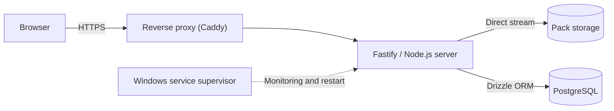

# BHLink

*[Lire en français](README.md)*

  
  
  
  

BHLink is a private application for distributing large FiveM packs (vehicles, maps, graphics) through temporary, usage-limited and protected links. It handles very large files end to end: upload, storage, resumable download, and day-to-day operations.

---

## Overview

| Admin dashboard | Download page |
| :---: | :---: |
|  |  |

| Sign-in | Supervision tool |
| :---: | :---: |
|  |  |

---

## Why BHLink

Sharing a multi-gigabyte pack with a team or customers through Google Drive, Mega or WeTransfer quickly becomes a problem: downloads restart from zero at the first network hiccup, bandwidth quotas block access without warning, and nothing stops someone from re-sharing the link. BHLink addresses all three: downloads resume where they stopped, files stay on our own storage, and every link is controlled (lifetime, quota, password, revocation).

---

## What the application does

### Resumable downloads

The server implements HTTP Range: it answers `206 Partial Content` to partial requests, handles `If-Range` and `ETag`, and returns `416` when the requested range is invalid. In practice, a browser or a download manager can pause, resume after a disconnect, or open several parallel connections without corrupting the file.

Files are read and sent as a stream with backpressure handling, so a 30 GB pack never goes through server memory. RAM usage is the same whether a 50 MB or a 50 GB file is being served.

A link's quota is only consumed once the file has been fully delivered. Opening the page, entering a wrong password or interrupting a download costs nothing. Resumes and parallel connections belonging to the same download count as a single use.

### Large file uploads

On the admin side, a pack is split in the browser into 16 MB chunks sent one after the other. The state of each upload is kept in the database: if the tab is closed, the network drops or the server restarts, the upload resumes from the last validated chunk instead of starting over. Before accepting a file, the server checks the remaining disk space and keeps a safety margin. A SHA-256 checksum is computed during the upload and shown on the download page, so recipients can verify the integrity of what they received.

### Links and access

Each link has a lifetime, a maximum number of uses and, optionally, a password. A link can be revoked at any time: no new request is accepted on that link (a download already started runs to completion). Unknown, expired and revoked links all show the same generic message, so nothing is revealed about their real state; only an exhausted link is reported explicitly.

### Security

- Download tokens are encrypted in the database (AES-GCM) and session identifiers are hashed: a copy of the database is not enough to replay a link or a session.
- Tokens present in download URLs are masked in access logs.
- The admin session can be kept for 30 days. It is stored in the database, survives a server restart, and is invalidated immediately on sign-out or password change.
- Signed `HttpOnly` / `SameSite=Lax` cookies, strict security headers and rate limiting on sign-in attempts.

---

## How it works

The application is a Fastify server written in TypeScript, behind a Caddy reverse proxy that handles HTTPS and certificates. PostgreSQL, accessed through Drizzle ORM, stores packs, links, users, sessions and the state of ongoing uploads. The server runs as a supervised Windows service that restarts automatically after a crash. Pages are rendered server-side, with a single React component for the interface animations.

---

## Operations

A few tools come with the application to keep it simple to run:

- **Encrypted backups**: a daily backup of the database, configuration and cover images, encrypted with AES-256-GCM, with automatic rotation, integrity checks and a tested restore procedure.
- **Safe updates**: the deployment script waits for a quiet moment (no upload or request in progress), so it never interrupts a transfer, backs up the running version, then checks the service health after restart. On failure, it rolls back to the previous version automatically.
- **Supervision tool**: a small local desktop application showing service status, certificate validity, disk space and backup status, with quick actions (restart, immediate backup). It opens no network port.

Tests cover the full link lifecycle (quotas, expiration, passwords, revocation), download and upload resume after interruption, and session persistence after restart.

---

## Project

This repository presents the application and how it works. The source code and operations scripts are kept in a private repository.

All rights reserved © 2026.

Designed and built by [bhpdev1](https://github.com/bhpdev1).
