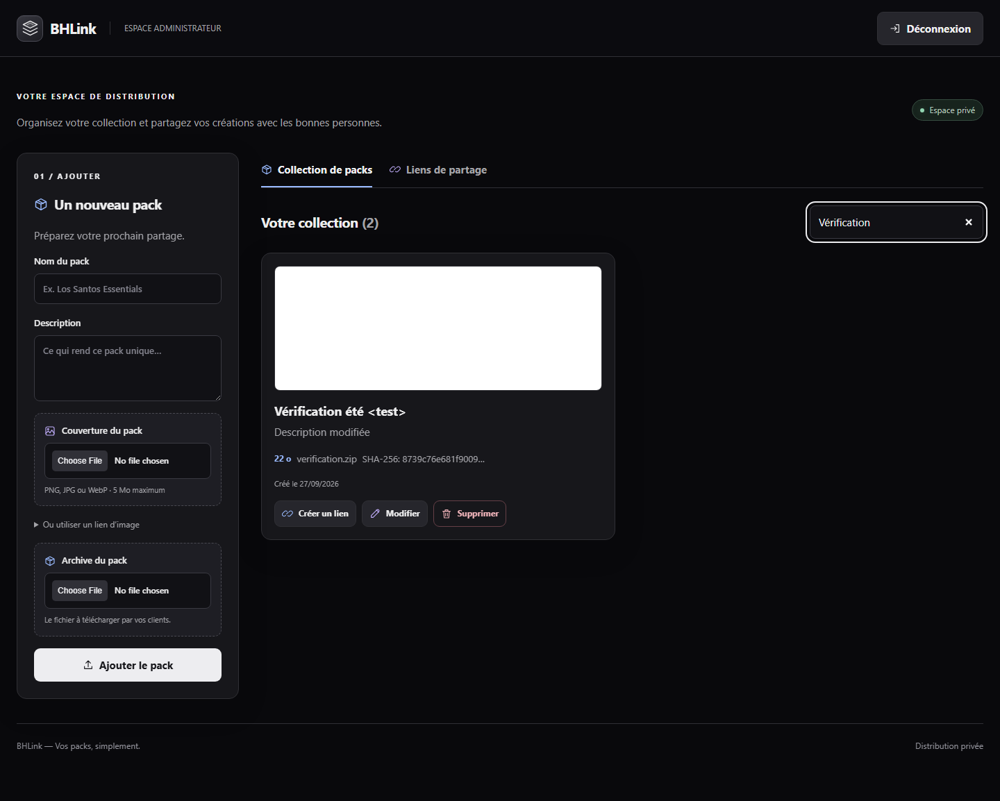
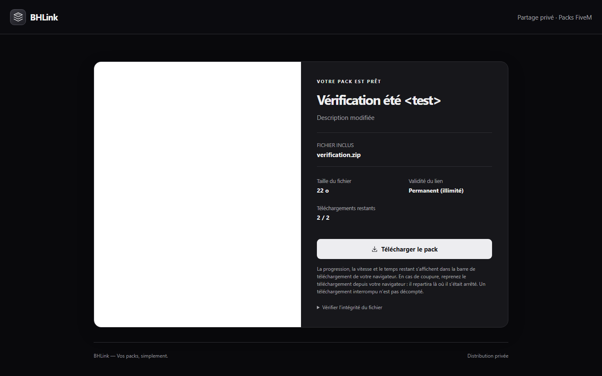
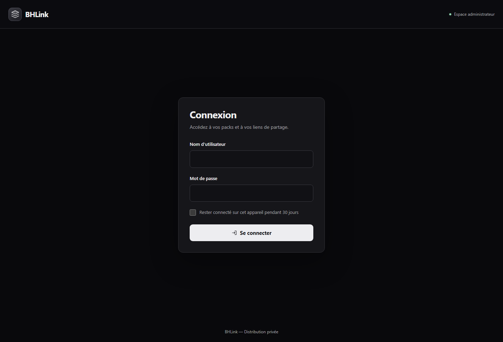
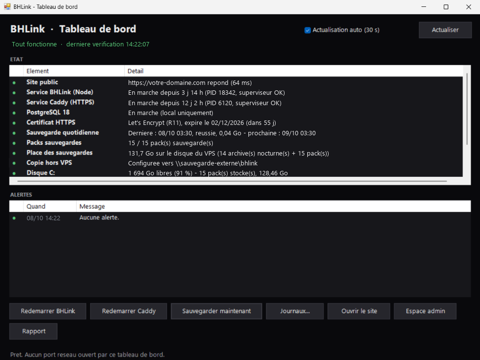
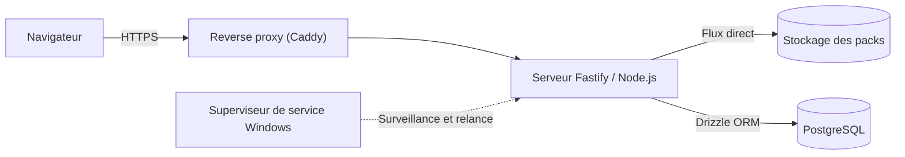

# BHLink

*[Read in English](README.en.md)*

  
  
  
  

BHLink est une application privée pour distribuer des packs FiveM volumineux (véhicules, maps, graphismes) via des liens temporaires, limités en nombre d'utilisations et protégés. Elle gère les très gros fichiers de bout en bout : envoi, stockage, téléchargement avec reprise, et suivi de l'exploitation.

---

## Aperçu

| Espace administrateur | Page de téléchargement |
| :---: | :---: |
|  |  |

| Connexion | Outil de supervision |
| :---: | :---: |
|  |  |

---

## Pourquoi BHLink

Partager un pack de plusieurs gigas avec une équipe ou des clients via Google Drive, Mega ou WeTransfer pose vite problème : le téléchargement repart de zéro à la moindre coupure, les quotas de bande passante bloquent sans prévenir, et rien n'empêche quelqu'un de repartager le lien. BHLink répond à ces trois points : le téléchargement reprend là où il s'est arrêté, les fichiers restent sur notre propre stockage, et chaque lien est contrôlé (durée, quota, mot de passe, révocation).

---

## Ce que fait l'application

### Téléchargement avec reprise

Le serveur implémente le protocole HTTP Range : il répond `206 Partial Content` aux requêtes partielles, gère `If-Range` et `ETag`, et renvoie `416` quand la plage demandée est invalide. Concrètement, un navigateur ou un gestionnaire de téléchargement peut mettre en pause, reprendre après une coupure ou ouvrir plusieurs connexions en parallèle sans corrompre le fichier.

Les fichiers sont lus et envoyés en flux, avec gestion de la contre-pression : un pack de 30 Go ne passe jamais par la mémoire du serveur. La consommation de RAM reste la même que l'on serve un fichier de 50 Mo ou de 50 Go.

Le quota d'un lien est décompté au volume réel d'octets transmis (`pendingBytes`) plutôt qu'au simple statut de clôture : chaque octet envoyé est cumulé par lien jusqu'à atteindre la taille du fichier, empêchant le contournement par interruption volontaire avant le dernier octet. Chaque téléchargeur dispose de son propre créneau via un cookie dédié (`bhl_dl`), évitant tout blocage mutuel entre utilisateurs partageant une même adresse IP (VPN/NAT). Les reprises (`Range`), le multi-connexions et les coupures accidentelles sont réconciliés et comptent pour un seul usage.

### Envoi des gros fichiers

Côté administration, un pack est découpé dans le navigateur en morceaux de 16 Mo envoyés les uns après les autres. L'état de chaque envoi est conservé en base : si l'onglet se ferme, si le réseau coupe ou si le serveur redémarre, l'envoi reprend au dernier morceau validé au lieu de recommencer. Avant d'accepter un fichier, le serveur vérifie l'espace disque restant et garde une marge de sécurité. Une empreinte SHA-256 est calculée pendant l'envoi et affichée sur la page de téléchargement, ce qui permet au destinataire de vérifier l'intégrité du fichier reçu.

### Liens et accès

Chaque lien a une durée de validité, un nombre maximum d'utilisations et, en option, un mot de passe. Un lien peut être révoqué à tout moment : plus aucune nouvelle requête n'est acceptée sur ce lien (un téléchargement déjà démarré va jusqu'à son terme). Les liens inconnus, expirés ou révoqués affichent le même message générique, pour ne rien révéler sur leur état réel ; seul un lien épuisé le signale explicitement.

### Sécurité

- Les jetons de téléchargement sont chiffrés en base (AES-GCM), les identifiants de session sont hachés : une copie de la base ne suffit pas pour rejouer un lien ou une session.
- Les jetons présents dans les URL de téléchargement sont masqués dans les journaux d'accès.
- La session administrateur peut être conservée 30 jours. Elle est stockée en base, survit à un redémarrage du serveur et est invalidée immédiatement à la déconnexion ou au changement de mot de passe.
- Cookies signés `HttpOnly` / `SameSite=Lax`, en-têtes de sécurité stricts et limitation du nombre de tentatives de connexion.

---

## Fonctionnement technique

L'application est un serveur Fastify en TypeScript, derrière un reverse proxy Caddy qui s'occupe du HTTPS et des certificats. PostgreSQL, accédé via Drizzle ORM, stocke les packs, les liens, les utilisateurs, les sessions et l'état des envois en cours. Le serveur tourne comme un service Windows supervisé, relancé automatiquement en cas de crash. Les pages sont rendues côté serveur, avec un seul composant React pour les animations de l'interface.

---

## Exploitation

Quelques outils accompagnent l'application pour qu'elle reste simple à faire tourner :

- **Sauvegardes chiffrées** : une sauvegarde quotidienne de la base, de la configuration et des couvertures, chiffrée en AES-256-GCM, avec rotation automatique, vérification d'intégrité et procédure de restauration testée.
- **Mises à jour sûres** : le script de déploiement attend un moment calme (aucun envoi ni requête en cours), n'interrompt donc pas un transfert, sauvegarde la version en place, puis vérifie l'état de santé du service après redémarrage. En cas d'échec, il revient automatiquement à la version précédente.
- **Outil de supervision** : une petite application de bureau, locale, qui affiche l'état des services, la validité du certificat, l'espace disque et l'état des sauvegardes, avec des actions rapides (redémarrage, sauvegarde immédiate). Elle n'ouvre aucun port réseau.

Les tests couvrent le cycle de vie complet des liens (quotas, expiration, mots de passe, révocation), la reprise des téléchargements et des envois après coupure, la concurrence simultanée et la persistance des sessions après redémarrage.

---

## Projet

Ce dépôt présente l'application et son fonctionnement. Le code source et les scripts d'exploitation sont conservés dans un dépôt privé.

Tous droits réservés © 2026.

Conçu et développé par [bhpdev1](https://github.com/bhpdev1).
